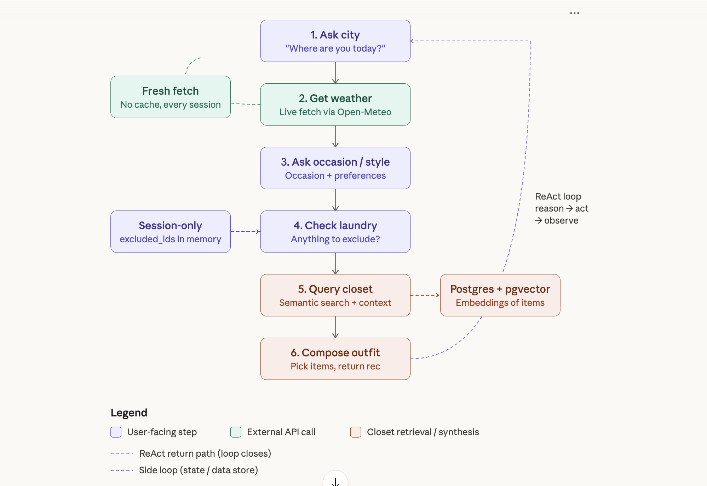

# Closet

AI-powered wardrobe manager and outfit recommender. Drop photos, get a smart closet that tells you what to wear.

A **single-agent ReAct orchestrator** (Reason → Act → Observe → Reason → answer) sitting on top of a **batch ETL/indexing pipeline**. One brain, five tools: `ask_user_for_city`, `get_weather`, `get_style_preferences`, `query_closet`, `compose_outfit`.

## Architecture



**Top lane:** Batch ingestion pipeline, fully offline. Photos enter the inbox, run through three cheap dedup layers (burst → phash → source) before any Gemini call burns money, then hit Gemini Vision for structured classification. Every detected item is turned into semantic text, embedded locally with MiniLM, and gated by the L4 semantic dedup diamond — the critical gate, because it sits before the expensive image-gen call. Duplicates exit and skip the rest. Unique items continue to Gemini image gen and land in Postgres + pgvector as a row containing both the cleaned image bytes and the chunk vector.

**Dashed handoff line:** The contract between the two halves. Ingestion writes, recommendation reads. Nothing else crosses it.

**Bottom lane:** The ReAct recommender — 6 steps in sequence. The dashed arrow from step 5 reaching up into the closet DB is the only coupling between the two systems: a read-only HNSW search.

### The Threshold Asymmetry

The most technically interesting decision in this system: **ingestion dedup uses distance < 0.15, outfit search uses distance < 1.5** — same HNSW index, same table, same vectors, two completely different jobs.

Derived empirically, not guessed. Pairwise cosine distances between all same-category items:

```
 0.00  ── true duplicates (same garment, different photo)
       ── GAP: nothing in 0.10–0.22 range ──
 0.15  ── DEDUP THRESHOLD (sits in the gap)
 0.22  ── closest different items (blue shirt vs red shirt)
 0.45  ── median distance
 1.50  ── SEARCH THRESHOLD (wide net, then rank)
```

## Project Structure

```
wardrobe/
├── agent.py      ReAct outfit agent — conversational multi-turn
├── vision.py     Gemini Vision classification + garment image gen
├── dedup.py      4-layer dedup (burst, hash, source, semantic)
├── store.py      Postgres + pgvector save and embed
├── builder.py    Batch ETL pipeline (process_inbox_photos)
├── outfit.py     Semantic search + scoring engine
├── routes.py     FastAPI endpoints
└── page.py       Streamlit UI
```

## Tech Stack

**Gemini 2.5 Flash** — Vision classification + garment image generation
**PostgreSQL 17 + pgvector** — wardrobe storage + HNSW vector search
**all-MiniLM-L6-v2** — 384-dim local embeddings (~50ms)
**Open-Meteo** — real-time weather, free, no key
**FastAPI** + **Streamlit** — API and UI

## API

| Endpoint | Description |
|----------|-------------|
| `GET /wardrobe/items` | List wardrobe |
| `GET /wardrobe/image/{id}` | Serve garment image |
| `POST /wardrobe/outfit?prompt=...` | Outfit recommendation |
| `POST /wardrobe/inbox` | Process inbox photos |
| `POST /wardrobe/items/add` | Upload single photo |
| `POST /wardrobe/reprocess` | Re-analyze all items |
